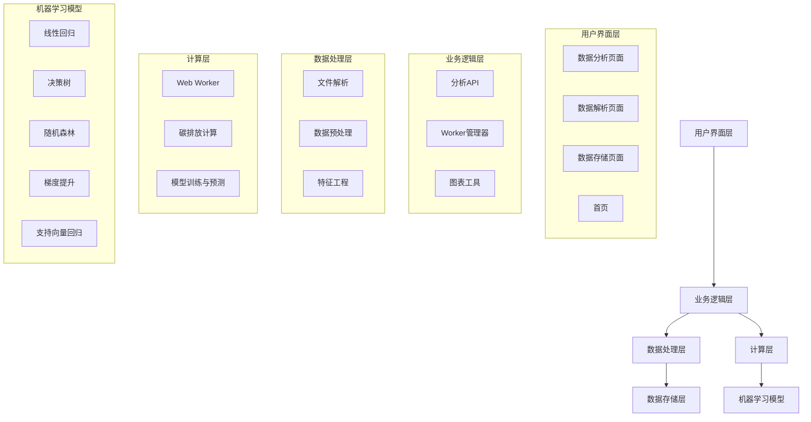

# 工业数据分析与预测系统

## 项目概述

### 1. 项目背景

随着工业数字化转型的深入推进，工业企业面临着越来越多的数据处理和分析需求。同时，全球气候变化问题日益严峻，碳减排成为工业企业的重要任务。为了帮助工业企业更好地应对这些挑战，我们开发了这套工业数据分析与预测系统。

### 2. 项目目标

本项目旨在：
- 提供直观、高效的工业数据分析工具，帮助企业发现数据中的价值
- 实现精准的碳排放量计算，为企业碳减排提供数据支持
- 构建多模型预测系统，帮助企业预测未来趋势，做出科学决策
- 降低数据分析门槛，使非专业人员也能轻松使用高级分析功能
- 提供跨设备兼容的用户体验，支持桌面端和移动端

### 3. 系统特点

- **全栈解决方案**：从数据导入、处理、分析到可视化，提供完整的数据处理流程
- **高性能计算**：使用Web Workers处理计算密集型任务，确保流畅的用户体验
- **多模型预测**：集成多种机器学习算法，提供更准确的预测结果
- **专业碳计算**：基于工业数据精准计算碳排放量，考虑多种影响因素
- **易于扩展**：模块化设计，支持自定义模型和分析功能
- **跨平台兼容**：基于微信小程序开发，可在各种设备上使用
- **智能错误处理**：完善的数据验证和错误处理机制，确保系统稳定性
- **响应式设计**：自适应不同屏幕尺寸，提供最佳用户体验

## 技术栈

### 前端技术
- **微信小程序原生开发**：使用WXML、WXSS、JavaScript构建用户界面
- **ES6+语法**：使用现代JavaScript特性提升开发效率
- **WXS**：微信小程序脚本语言，用于优化渲染性能
- **图表库**：使用微信小程序原生Canvas API绘制数据可视化图表
- **响应式设计**：实现桌面端和移动端的自适应布局
- **错误处理**：完善的try-catch机制和错误状态管理

### 后端技术
- **微信云开发**：提供无服务器云函数、云数据库和云存储服务
- **Node.js**：用于云函数开发和服务端逻辑处理

### 数据处理与分析
- **Web Workers**：用于处理计算密集型任务，避免阻塞主线程
- **机器学习算法**：实现了多种预测模型，包括线性回归、决策树、随机森林、梯度提升和支持向量回归
- **数据可视化**：使用Canvas API实现数据图表的绘制和交互
- **数据存储**：支持CSV、Excel等格式的数据导入和分析

### 性能优化
- **并行计算**：使用Web Workers实现多线程计算
- **数据采样**：对大规模数据进行采样处理，提高分析速度
- **内存管理**：优化数据结构和算法，减少内存占用
- **代码分割**：将功能模块拆分，按需加载

## 系统架构

### 1. 架构概述

本系统采用分层架构设计，将前端展示、业务逻辑和数据处理分离，确保系统的可维护性和扩展性。

### 2. 核心架构图



### 3. 数据流

1. **数据输入**：用户通过数据解析页面上传CSV、Excel等格式的工业数据
2. **数据处理**：系统对原始数据进行清洗、转换和特征提取
3. **数据分析**：根据用户选择的分析类型，调用相应的分析方法
4. **计算密集型任务**：将碳排放计算和模型训练等计算密集型任务发送到Web Worker处理
5. **结果展示**：将分析结果通过图表等形式展示给用户
6. **数据存储**：分析结果可存储到本地或云端，方便后续查询和使用

## 核心功能详解

### 1. 碳排放量计算

#### 1.1 计算原理

系统基于以下公式计算碳排放量：

```
直接碳排放 = 原辅料带入CO2 + 能源带入CO2 - 产品带出CO2 - 回收CO2
```

#### 1.2 计算因素

系统考虑了多种碳排放因素：
- **能源消耗**：包括焦炭、煤粉等能源的消耗
- **原辅料带入**：包括铁矿石、石灰石等原料中的碳含量
- **产品带出**：包括铁水等产品中的碳含量
- **回收利用**：包括高炉煤气等回收利用的碳含量

#### 1.3 计算参数

| 参数名称 | 描述 | 默认值 | 单位 |
|---------|------|-------|------|
| hotmetal_Fe_content | 铁水含铁量 | 0.9524 | - |
| hotmetal_C_content | 铁水含碳量 | 0.0412 | - |
| hotmetal_weight | 铁水重量 | 1 | t |
| ore_Fe_content | 矿石含铁量 | 0.58145 | - |
| ore_FeO_content | 矿石含FeO量 | 0.07671 | - |
| coke_C_content | 焦炭含碳量 | 0.8631 | - |
| coke_weight | 焦炭重量 | 300 | kg |
| PC_C_content | 煤粉含碳量 | 0.783 | - |
| PC_weight | 煤粉重量 | 160 | kg |
| flux_CaCO3_content | 熔剂含CaCO3量 | 0.1464 | - |
| flux_MgCO3_content | 熔剂含MgCO3量 | 0.1465 | - |
| flux_weight | 熔剂重量 | 110 | kg |
| BFG_CO_volumefraction | 高炉煤气CO体积分数 | 0.23 | - |
| BFG_CO2_volumefraction | 高炉煤气CO2体积分数 | 0.18 | - |
| BFG_production | 高炉煤气产量 | 1500 | m³ |
| BFG_consumption | 高炉煤气消耗量 | 430 | m³ |

#### 1.4 可视化展示

系统提供多种图表展示碳排放计算结果：
- **柱状图**：展示不同来源的碳排放量
- **趋势图**：展示碳排放随时间的变化趋势
- **对比图**：对比不同参数设置下的碳排放量

### 2. 多模型预测

#### 2.1 支持的模型

| 模型名称 | 算法类型 | 适用场景 | 特点 |
|---------|---------|---------|------|
| 线性回归 | 统计学习 | 线性关系预测 | 简单快速，可解释性强 |
| 决策树 | 监督学习 | 非线性关系预测 | 可处理复杂关系，可视化友好 |
| 随机森林 | 集成学习 | 高精度预测 | 抗过拟合，性能稳定 |
| 梯度提升 | 集成学习 | 高精度预测 | 对特征重要性敏感，精度高 |
| 支持向量回归 | 监督学习 | 复杂关系预测 | 适合高维数据，泛化能力强 |

#### 2.2 模型评估指标

系统使用多种指标评估模型性能：
- **MSE（均方误差）**：评估预测值与实际值的平均平方误差
- **RMSE（均方根误差）**：MSE的平方根，与实际值单位一致
- **R²（决定系数）**：评估模型对数据变异的解释程度
- **MAE（平均绝对误差）**：评估预测值与实际值的平均绝对误差
- **MAPE（平均绝对百分比误差）**：评估预测值与实际值的相对误差

#### 2.3 模型集成策略

系统支持多种模型集成策略，提高预测精度：
- **投票法**：多个模型投票决定最终预测结果
- **加权平均**：根据模型性能分配不同权重
- **堆叠集成**：使用元模型学习基础模型的预测结果

### 3. 数据导入与解析

#### 3.1 支持的文件格式

- **CSV**：逗号分隔值文件
- **Excel**：XLS、XLSX格式文件
- **TXT**：文本文件

#### 3.2 数据预处理

系统对导入的数据进行自动预处理：
- **数据清洗**：处理缺失值、异常值
- **数据转换**：将非数值数据转换为数值
- **数据标准化**：对数据进行标准化处理，提高模型性能

#### 3.3 数据质量检查

系统提供数据质量检查功能：
- **缺失值检测**：检测并统计数据中的缺失值
- **异常值检测**：使用统计方法检测异常值
- **数据一致性检查**：检查数据格式和范围的一致性

### 4. 数据可视化

#### 4.1 支持的图表类型

- **折线图**：展示数据随时间的变化趋势
- **柱状图**：比较不同类别的数据
- **散点图**：展示两个变量之间的关系
- **饼图**：展示数据的组成比例
- **直方图**：展示数据的分布情况

#### 4.2 交互功能

- **图表缩放**：支持图表的缩放和拖拽
- **数据点交互**：点击数据点查看详细信息
- **图表导出**：支持将图表保存为图片

### 5. 数据存储与管理

#### 5.1 存储方式

- **本地存储**：使用微信小程序本地存储API
- **云存储**：使用微信云开发存储服务

#### 5.2 数据查询

系统支持SQL-like语法查询数据：
- **基本查询**：查询指定条件的数据
- **聚合查询**：对数据进行求和、平均值等聚合操作
- **排序查询**：对查询结果进行排序

## 技术实现细节

### 1. Web Worker使用

#### 1.1 工作原理

Web Worker允许在后台线程中执行JavaScript代码，避免阻塞主线程。本系统使用Web Worker处理以下任务：

- **碳排放计算**：复杂的碳排放量计算
- **模型训练**：机器学习模型的训练过程
- **大规模数据处理**：处理海量工业数据

#### 1.2 实现代码

```javascript
// 创建Worker
this.worker = wx.createWorker('worker/analysisWorker.js');

// 发送任务到Worker
this.worker.postMessage({
  id: taskId,
  action: 'analyze',
  data: data,
  analysisType: analysisType,
  options: options
});

// 处理Worker返回的结果
this.worker.onMessage((message) => {
  const { id, success, result, error } = message;
  // 处理结果
});
```

### 2. 机器学习模型实现

#### 2.1 模型架构

系统采用模块化设计实现机器学习模型：
- **基础模型类**：定义所有模型的通用接口
- **模型工厂**：动态创建和管理模型
- **模型集成器**：集成多个模型的预测结果
- **模型评估器**：评估模型性能

#### 2.2 线性回归实现

```javascript
// 线性回归模型实现
class LinearRegression extends BaseModel {
  // 使用最小二乘法训练模型
  train(X, y) {
    // 添加偏置项
    const XWithBias = X.map(row => [1, ...row]);
    
    // 计算X'X
    const XTX = this.calculateXTX(XWithBias);
    
    // 计算X'y
    const XTy = this.calculateXTy(XWithBias, y);
    
    // 计算系数
    const XTXinv = this.matrixInverse(XTX);
    this.coefficients = this.matrixMultiply(XTXinv, XTy);
    
    this.isTrained = true;
  }
  
  // 预测
  predict(x) {
    if (!this.isTrained) {
      throw new Error('Model not trained');
    }
    
    let result = this.coefficients[0];
    for (let i = 0; i < x.length; i++) {
      result += this.coefficients[i + 1] * x[i];
    }
    return result;
  }
}
```

### 3. 图表渲染优化

#### 3.1 性能优化策略

- **数据采样**：对大规模数据进行采样，减少渲染点数
- **Canvas优化**：使用离屏Canvas和批处理绘制
- **懒加载**：仅在需要时渲染图表
- **缓存机制**：缓存已渲染的图表数据

#### 3.2 实现代码

```javascript
// 图表渲染优化
const drawLineChart = withErrorBoundary(function(ctx, chartData, options = {}) {
  // 大数据集采样优化
  const sampledSeries = series.map((s) => ({
    ...s,
    data: sampleData(s.data, 1000)
  }));
  
  // 智能标签截断
  const truncatedLabels = xAxisData.map(label => truncateLabel(label, 10));
  
  // 绘制图表
  // ...
});
```

## 使用指南

### 1. 快速开始

#### 1.1 环境要求

- 微信开发者工具
- 微信小程序账号
- 微信云开发环境

#### 1.2 项目初始化

1. 克隆项目到本地
2. 使用微信开发者工具打开项目
3. 配置云开发环境
4. 安装依赖包

#### 1.3 云函数部署

1. 在微信开发者工具中，右键点击 `cloudfunctions` 目录
2. 选择 "上传并部署所有云函数"
3. 等待云函数部署完成

#### 1.4 运行项目

1. 在微信开发者工具中，点击 "编译" 按钮
2. 使用微信扫码预览或在模拟器中查看

### 2. 详细使用教程

#### 2.1 数据上传与解析

1. **进入数据解析页面**：点击首页的 "数据解析" 入口
2. **选择文件**：点击 "选择文件" 按钮，选择要上传的CSV或Excel文件
3. **预览数据**：系统自动解析文件内容并显示预览
4. **导入数据**：点击 "导入数据" 按钮，将数据导入系统

#### 2.2 数据分析

1. **进入数据分析页面**：点击首页的 "数据分析" 入口
2. **选择分析类型**：从下拉菜单中选择要执行的分析类型
3. **选择目标变量**：如果分析类型需要目标变量，从下拉菜单中选择
4. **执行分析**：点击 "开始分析" 按钮，系统开始执行分析
5. **查看结果**：分析完成后，系统会显示分析结果和图表
6. **交互操作**：点击图表可查看详细信息，支持缩放和拖拽

#### 2.3 模型预测

1. **进入数据分析页面**：点击首页的 "数据分析" 入口
2. **选择多模型预测**：从分析类型下拉菜单中选择 "多模型预测"
3. **选择目标变量**：从下拉菜单中选择要预测的目标变量
4. **选择模型**：选择要使用的预测模型（可多选）
5. **执行预测**：点击 "开始分析" 按钮，系统开始执行预测
6. **查看结果**：预测完成后，系统会显示各模型的预测结果和性能指标
7. **比较模型**：系统会自动比较各模型的性能，推荐最优模型

#### 2.4 数据管理

1. **进入数据存储页面**：点击首页的 "数据存储" 入口
2. **查看数据**：系统会显示已存储的数据列表
3. **查询数据**：在搜索框中输入查询条件，点击 "查询" 按钮
4. **导出数据**：点击 "导出" 按钮，将数据导出为CSV或Excel格式
5. **删除数据**：选择要删除的数据，点击 "删除" 按钮

## 性能优化

### 1. 计算密集型任务优化

- **Web Workers**：将计算密集型任务发送到Web Worker处理
- **数据采样**：对大规模数据进行采样，减少计算量
- **算法优化**：使用更高效的算法实现

### 2. 内存管理优化

- **数据结构**：使用合适的数据结构，减少内存占用
- **垃圾回收**：及时释放不再使用的内存
- **流式处理**：对大数据使用流式处理，避免一次性加载全部数据

### 3. 网络请求优化

- **请求缓存**：缓存重复的网络请求
- **数据压缩**：对传输的数据进行压缩
- **批量请求**：将多个请求合并为一个批量请求

### 4. 渲染性能优化

- **Canvas优化**：使用Canvas绘制图表，减少DOM操作
- **懒加载**：仅在需要时渲染内容
- **虚拟列表**：对长列表使用虚拟滚动

## 扩展性设计

### 1. 模型扩展

要添加自定义机器学习模型，只需：

1. 继承 `BaseModel` 类
2. 实现 `train` 和 `predict` 方法
3. 在 `modelFactory.js` 中注册模型

```javascript
// 自定义模型示例
class CustomModel extends BaseModel {
  train(X, y) {
    // 实现训练逻辑
  }
  
  predict(x) {
    // 实现预测逻辑
  }
}

// 在模型工厂中注册
modelFactory.register('custom', CustomModel);
```

### 2. 分析功能扩展

要添加自定义分析功能，只需：

1. 在 `analysisApi.js` 中添加新的分析方法
2. 在 `workerManager.js` 中添加新的Worker任务类型
3. 在 `analysisWorker.js` 中实现分析逻辑
4. 在 `analysis.js` 中添加对应的图表绘制方法

### 3. 页面扩展

要添加新页面，只需：

1. 在 `pages` 目录下创建新的页面文件夹
2. 创建对应的WXML、WXSS、JS和JSON文件
3. 在 `app.json` 中注册新页面

## 故障排除

### 1. 常见错误

#### 1.1 文件解析错误

- **症状**：上传文件后提示解析失败
- **原因**：文件格式不正确或文件内容不符合要求
- **解决方法**：检查文件格式，确保是CSV或Excel格式；检查文件内容，确保数据结构正确

#### 1.2 计算超时错误

- **症状**：执行分析时提示计算超时
- **原因**：数据量过大或计算复杂度太高
- **解决方法**：减少数据量或使用数据采样；选择更适合的分析方法或模型

#### 1.3 内存不足错误

- **症状**：执行分析时提示内存不足
- **原因**：数据量过大或内存管理不当
- **解决方法**：减少数据量或使用数据采样；优化代码，减少内存占用

#### 1.4 云函数调用失败

- **症状**：执行需要云函数的操作时失败
- **原因**：云函数部署失败或网络连接问题
- **解决方法**：检查云函数部署状态；检查网络连接

### 2. 性能问题

#### 2.1 页面加载缓慢

- **原因**：页面结构复杂或数据加载过多
- **解决方法**：优化页面结构，减少嵌套层级；实现数据懒加载

#### 2.2 图表渲染卡顿

- **原因**：图表数据过多或渲染逻辑复杂
- **解决方法**：减少图表数据点；优化渲染逻辑，使用requestAnimationFrame

#### 2.3 分析计算缓慢

- **原因**：数据量过大或算法复杂度高
- **解决方法**：使用Web Workers；优化算法；使用数据采样

## 未来规划

### 1. 功能增强

- **深度学习模型**：添加深度学习模型，提高预测精度
- **时间序列分析**：添加时间序列分析功能，预测长期趋势
- **报告生成**：自动生成分析报告，方便用户分享
- **用户权限管理**：添加多用户支持和权限管理

### 2. 性能优化

- **GPU加速**：利用GPU加速机器学习模型训练
- **分布式计算**：支持分布式计算，处理更大规模的数据
- **模型压缩**：压缩机器学习模型，减少存储空间和加载时间

### 3. 用户体验

- **界面优化**：优化界面设计，提升用户体验
- **交互增强**：添加更多交互功能和动画效果
- **响应式设计**：适配不同尺寸的设备
- **主题切换**：支持浅色/深色主题切换

### 4. 行业应用

- **电力行业**：针对电力行业的数据分析和预测
- **化工行业**：针对化工行业的碳排放计算和优化
- **制造业**：针对制造业的生产预测和优化
- **能源行业**：针对能源行业的能源消耗分析和预测

## 贡献指南

### 1. 代码规范

- **ESLint**：遵循ESLint代码规范
- **缩进**：使用4个空格进行缩进
- **命名**：变量和函数使用驼峰命名法，类名使用帕斯卡命名法
- **注释**：使用JSDoc格式注释

### 2. 提交规范

- **提交信息**：使用中文，格式为：`[类型] 描述`
- **类型**：feat（新功能）、fix（修复）、docs（文档）、style（样式）、refactor（重构）、test（测试）、chore（构建）
- **描述**：简洁明了，描述清楚修改内容

### 3. 测试

- **单元测试**：为新功能添加单元测试
- **集成测试**：确保新功能与现有功能兼容
- **测试覆盖**：确保测试覆盖主要功能和边界情况

### 4. 文档

- **更新文档**：为新功能添加文档
- **保持同步**：确保文档与代码同步更新
- **清晰明了**：文档要清晰易懂，便于其他开发者理解

## 许可证

本项目采用MIT许可证。详见LICENSE文件。

## 联系方式

- **项目维护者**：[您的姓名]
- **邮箱**：[您的邮箱]
- **微信**：[您的微信号]
- **GitHub**：[项目GitHub地址]

---

**© 2026 工业数据分析与预测系统. 保留所有权利.**
#### 自定义预处理 (utils/customPreprocess.js)
- 实现数据的自定义预处理逻辑
- 支持数据清洗、转换和特征提取
- 提供预处理规则的配置和管理

#### SQL存储工具 (utils/sqlStore.js)
- 实现数据的本地存储和查询
- 支持SQL-like查询语法
- 优化数据存储和检索性能

#### 通用工具函数 (utils/common.js)
- 提供各种通用工具函数
- 处理日期、数字、字符串等数据类型的转换和格式化
- 实现常用的算法和工具方法

### 机器学习模型

#### 基础模型 (utils/models/baseModel.js)
- 定义所有预测模型的基类
- 实现模型的通用方法和属性
- 提供模型训练、预测和评估的标准接口

#### 模型工厂 (utils/models/modelFactory.js)
- 动态创建和管理预测模型
- 支持模型的注册和获取
- 实现模型的依赖注入和生命周期管理

#### 模型集成器 (utils/models/modelIntegrator.js)
- 集成多个预测模型的结果
- 实现模型集成策略，如投票、加权平均等
- 提供集成模型的训练和预测功能

#### 线性回归 (utils/models/linearRegression.js)
- 实现线性回归算法，支持最小二乘法和梯度下降
- 提供模型参数的计算和优化
- 支持多变量线性回归

#### 决策树 (utils/models/decisionTree.js)
- 实现CART算法的决策树
- 支持回归任务的树构建和剪枝
- 提供特征重要性评估

#### 随机森林 (utils/models/randomForest.js)
- 实现随机森林算法，集成多个决策树
- 支持并行训练和预测
- 提供模型参数的调优功能

#### 梯度提升 (utils/models/gradientBoosting.js)
- 实现梯度提升算法，通过迭代优化减少误差
- 支持不同的基学习器和损失函数
- 提供学习率和迭代次数的调优

#### 支持向量回归 (utils/models/supportVectorRegression.js)
- 实现支持向量回归算法
- 支持线性、多项式、径向基和sigmoid核函数
- 提供正则化参数和核函数参数的调优

#### 模型评估器 (utils/models/modelEvaluator.js)
- 实现模型性能评估功能
- 支持MSE、RMSE、R²、MAE、MAPE等评估指标
- 提供交叉验证和模型比较功能

#### 参数优化器 (utils/models/parameterOptimizer.js)
- 实现模型参数的优化功能
- 支持网格搜索和随机搜索方法
- 提供参数空间的定义和搜索策略

### Web Worker

#### 分析Worker (worker/analysisWorker.js)
- 处理计算密集型任务，如碳排放量计算和多模型预测
- 实现Worker与主线程的通信协议
- 优化计算性能和内存使用

### 云函数

#### 数据备份 (cloudfunctions/backup/index.js)
- 实现数据的云备份功能
- 支持定期备份和手动备份
- 提供备份状态的监控和管理

#### 数据处理 (cloudfunctions/dataProcess/index.js)
- 处理云端数据处理任务
- 支持大规模数据的分析和计算
- 提供数据处理结果的存储和获取

## 核心功能

### 1. 碳排放量计算
- 基于工业数据计算碳排放量
- 考虑能源消耗、运输和废弃物等因素
- 提供碳排放趋势分析和可视化

### 2. 多模型预测
- 支持多种机器学习算法进行预测
- 提供模型评估和比较功能
- 实现参数优化和模型集成
- 支持预测结果的可视化展示
- **智能错误处理**：自动处理NaN值和异常数据，确保预测结果的可靠性

### 3. 数据导入与解析
- 支持CSV、Excel等格式文件的导入
- 实现数据自动解析和预处理
- 提供数据质量检查和错误提示
- **英文表头到中文映射**：自动将英文技术术语转换为中文，提升用户体验
- **大文件解析优化**：使用Worker线程处理大文件解析，支持最大4MB文件

### 4. 数据可视化
- 实现多种图表类型，包括折线图、柱状图、水平条形图等
- 支持图表的缩放、拖拽和交互
- 提供数据趋势分析和异常检测
- **表格优化**：实现首列冻结和列宽自适应，提升表格可读性
- **移动端适配**：优化图表在移动端的显示，包括水平条形图和标签旋转

### 5. 数据存储与管理
- 支持本地数据存储和管理
- 提供数据查询和筛选功能
- 实现数据备份和恢复
- 支持SQL-like语法查询数据

### 6. 交互与布局优化
- **下拉菜单优化**：使用底部弹窗替代遮挡式下拉菜单，保持上下文可见
- **加载状态优化**：提供详细的加载提示和进度反馈
- **响应式设计**：自适应不同屏幕尺寸，提供最佳用户体验
- **桌面端增强**：支持键盘快捷键和鼠标交互

### 7. 性能优化
- **Web Worker集成**：使用Worker线程处理计算密集型任务
- **数据采样策略**：根据设备类型自动调整数据采样率
- **内存管理**：优化数据结构和算法，减少内存占用

### 8. 视觉设计
- **暗黑模式**：专业的暗黑模式设计，优化对比度和视觉体验
- **一致性**：统一的设计语言和视觉风格
- **层次感**：清晰的视觉层级，提升信息传达效率

## 快速开始

### 环境要求
- 微信开发者工具
- 微信小程序账号
- 微信云开发环境

### 项目初始化
1. 克隆项目到本地
2. 使用微信开发者工具打开项目
3. 配置云开发环境
4. 安装依赖包

### 云函数部署
1. 在微信开发者工具中，右键点击 `cloudfunctions` 目录
2. 选择 "上传并部署所有云函数"
3. 等待云函数部署完成

### 运行项目
1. 在微信开发者工具中，点击 "编译" 按钮
2. 使用微信扫码预览或在模拟器中查看

## 使用指南

### 数据上传
1. 进入 "数据解析" 页面
2. 点击 "选择文件" 按钮，选择要上传的CSV或Excel文件
3. 系统自动解析文件内容并显示预览
4. 点击 "导入数据" 按钮，将数据导入系统

### 数据分析
1. 进入 "数据分析" 页面
2. 选择要分析的数据和分析类型
3. 系统自动执行分析并生成图表
4. 可以通过缩放、拖拽等操作交互查看图表

### 模型预测
1. 进入 "数据分析" 页面，选择 "多模型预测"
2. 选择要预测的数据和目标变量
3. 选择要使用的预测模型（可多选）
4. 系统自动执行预测并生成结果
5. 可以查看不同模型的预测性能和比较

### 数据管理
1. 进入 "数据存储" 页面
2. 可以查看、编辑和删除已存储的数据
3. 可以使用SQL语句查询数据
4. 可以导出数据为CSV或Excel格式

## 性能优化

### 计算密集型任务优化
- 使用Web Workers处理计算密集型任务，避免阻塞主线程
- 实现并行计算，提高处理速度
- 对大规模数据进行采样处理，减少计算量
- **Worker线程管理**：实现了Worker线程的初始化、通信和错误处理，确保稳定运行

### 内存管理优化
- 使用高效的数据结构和算法，减少内存占用
- 及时释放不再使用的内存
- 实现数据的流式处理，避免一次性加载全部数据
- **数据验证**：在解析和处理数据时进行严格的数据验证，避免无效数据占用内存

### 网络请求优化
- 使用微信云开发的CDN加速，减少网络延迟
- 实现请求缓存，避免重复请求
- 优化数据传输格式，减少传输量

### 渲染性能优化
- 使用WXS提升渲染性能
- 优化Canvas绘制，减少重绘和重排
- 实现虚拟列表，优化长列表渲染
- **图表渲染优化**：对大数据集进行采样，使用水平条形图优化移动端标签显示

## 扩展性设计

### 模型扩展
- 继承 `BaseModel` 类实现自定义模型
- 在 `modelFactory.js` 中注册新模型
- 实现模型的训练、预测和评估方法

### 分析功能扩展
- 在 `analysisApi.js` 中添加新的分析方法
- 在 `workerManager.js` 中添加新的Worker任务类型
- 在 `analysisWorker.js` 中实现新的分析逻辑

### 页面扩展
- 按照微信小程序的页面结构创建新页面
- 在 `app.json` 中注册新页面
- 实现页面的布局、样式和逻辑

## 故障排除

### 常见错误

#### 1. 文件解析错误
- **症状**：上传文件后提示解析失败
- **原因**：文件格式不正确或文件内容不符合要求
- **解决方法**：检查文件格式，确保是CSV或Excel格式；检查文件内容，确保数据结构正确

#### 2. 计算超时错误
- **症状**：执行分析时提示计算超时
- **原因**：数据量过大或计算复杂度太高
- **解决方法**：减少数据量或使用数据采样；选择更适合的分析方法或模型

#### 3. 内存不足错误
- **症状**：执行分析时提示内存不足
- **原因**：数据量过大或内存管理不当
- **解决方法**：减少数据量或使用数据采样；优化代码，减少内存占用

#### 4. 云函数调用失败
- **症状**：执行需要云函数的操作时失败
- **原因**：云函数部署失败或网络连接问题
- **解决方法**：检查云函数部署状态；检查网络连接

#### 5. NaN值错误
- **症状**：模型预测结果显示NaN值
- **原因**：输入数据中包含无效值或计算过程中出现异常
- **解决方法**：系统已实现自动处理NaN值的机制，会将NaN值转换为0或其他合理值

#### 6. 图表渲染错误
- **症状**：图表显示异常或无法渲染
- **原因**：数据格式不正确或Canvas绘制失败
- **解决方法**：检查输入数据格式；确保Canvas尺寸设置正确

### 性能问题

#### 1. 页面加载缓慢
- **原因**：页面结构复杂或数据加载过多
- **解决方法**：优化页面结构，减少嵌套层级；实现数据懒加载

#### 2. 图表渲染卡顿
- **原因**：图表数据过多或渲染逻辑复杂
- **解决方法**：减少图表数据点；优化渲染逻辑，使用requestAnimationFrame

#### 3. 分析计算缓慢
- **原因**：数据量过大或算法复杂度高
- **解决方法**：使用Web Workers；优化算法；使用数据采样

## 未来规划

### 功能增强
- 添加更多机器学习模型，如深度学习模型
- 实现更复杂的数据分析功能，如时间序列分析
- 添加数据导出和报告生成功能
- 实现用户权限管理和多用户支持

### 性能优化
- 进一步优化Web Workers的使用
- 实现更高效的数据存储和检索
- 优化模型训练和预测速度
- 减少应用体积和启动时间

### 用户体验
- 优化界面设计，提升用户体验
- 添加更多交互功能和动画效果
- 实现响应式设计，适配不同设备
- 添加主题切换功能

### 行业应用
- 扩展到更多工业领域，如电力、化工等
- 与工业物联网设备集成，实现实时数据监控
- 提供行业特定的分析模型和预测算法
- 开发企业级解决方案，满足不同规模企业的需求

## 贡献指南

### 代码规范
- 遵循ESLint代码规范
- 使用4个空格进行缩进
- 变量和函数命名使用驼峰命名法
- 类名使用帕斯卡命名法
- 注释使用JSDoc格式

### 提交规范
- 提交信息使用中文，格式为：`[类型] 描述`
- 类型包括：feat（新功能）、fix（修复）、docs（文档）、style（样式）、refactor（重构）、test（测试）、chore（构建）
- 提交信息要简洁明了，描述清楚修改内容

### 测试
- 为新功能添加单元测试
- 确保所有测试通过后再提交代码
- 定期运行集成测试，确保系统稳定性

### 文档
- 为新功能添加文档
- 保持文档与代码同步更新
- 文档要清晰明了，便于理解和使用

## 许可证

本项目采用MIT许可证。详见LICENSE文件。

## 联系方式

- 项目维护者：[您的姓名]
- 邮箱：[您的邮箱]
- 微信：[您的微信号]

---

**© 2026 工业数据分析与预测系统. 保留所有权利.**